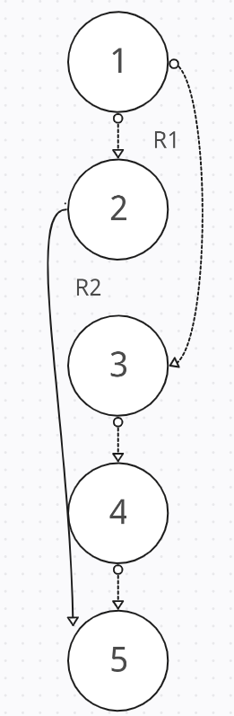
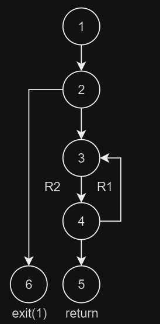
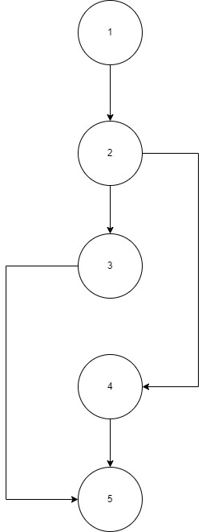

# | **ESIZON**

## _**Metodología de la Programación**_

_1º Grado en Ingeniería Informática_


*Edison Marimon Cook*

*Carlos Barrera Gutiérrez*

*Pablo Rivero Galvín*

*Carlos Núñez Baro*

***


## **| Vista General de Contenidos**


### 1. **Objeto del Proyecto**

***

Proyecto de la asignatura de Metodología de la Programación de la Universidad de Cádiz. 1º curso del Grado en Ingeniería Informática.

El grupo compuesto por los integrantes mencionados en la portada del proyecto se compremete al desarrollo de un programa en C capaz de funcionar como una plataforma de comercio electrónico online, que permita la adquisión de multitud de productos de todo tipo, los cuales estarán clasificados en diferentes categorías. Objetivos fundamentales:

* Aprender a realizar una descomposición adecuada del problema en distintos módulos, maximizando la cohesión y minimizando el acoplamiento. 
* Aprender a resolver problemas descomponiéndolos en diferentes módulos (ficheros) y realizar compilación separada. 
* Aprender a documentar programas. 
* Realizar el desarrollo de un programa trabajando en equipo de manera organizada.

### 2. **Documentación de Usuario**

***

#### 2.1 **Descripción Funcional**

Tal y como se ha comentado anteriormente, ESIZON busca ofrecer un servicio de compra-venta a los usuarios que la utilizan.

A través de una interfaz simple dependiente de teclado se permite al usuario manejar las distintas funcionalidades que ofrece ESIZON incluyendo herramientas de moderación y administración de usuario para facilitar la gestión de la aplicación.

La aplicación incluye herramientas capaces de facilitar la tarea de gestión y administración, es decir, herramientas de moderación. Así, se hace uso de un sistema de identificación de usuario que distingue entre dos categorías de usuario:

* **Cliente** - Con acceso a los datos de su perfil, que podrá realizar búsquedas de productos,
pedidos, devoluciones, añadir dinero a la cartera, etc.
* **Administrador** - Realizará las tareas de configuración de la plataforma, como
tratamiento de clientes, productos propios, pedidos de clientes, devoluciones, stock, ESILockers, proveedores, etc.

* **Proveedor** - Realizará las tareas de configuración de los productos de su propiedad
como la gestión de sus productos, stock, devoluciones, etc. También podrá acceder a los datos de su perfil.

* **Transportista** - Que se encargará de realizar las tareas de actualización de su perfil y
repartos de pedidos que le han sido asignados.


#### 2.2 **Tecnología**

 Las herramientas utilizadas en el desarrollo de la aplicación (tanto de programación como de documentación) son las siguientes:

1. [CodeBlocks](https://sourceforge.net/projects/codeblocks/), para la generación de código.
2. [Dev C++](https://sourceforge.net/projects/orwelldevcpp/), para la generación de código.
3. [Visual Studio Code](https://code.visualstudio.com/), para la generación de código.


#### 2.3 **Manual de Instalación**

ESIZON puede ser descargado por cualquier persona con conexión a internet y acceso a un navegador convencionar (ej. Google Chrome, Opera y sus variantes, Brave, etc...), de manera que puede descargarse gratuitamente desde nuestro repositorio en [GitHub](https://github.com/EdisonMarimonCook/MP-2024-C2-G3). 

ESIZON cuenta con exigencias mínimas de prestaciones de equipo, de manera que prácticamente cualquier equipo con los componentes básicos de un ordenador (todos ellos funcionales) será capaz de ejecutar la aplicación de forma fluida e ininterrumpida. Requisitos básicos orientativos:

* Sistema Operativo Windows XP.
* 512MB de RAM libres.
* 100MB de espacio libre en memoria.

Para ello hay que entrar en el directorio source, compilar el programa con el compilador de C que prefiera y ejecutarlo.

En el siguiente ejemplo utilizaremos el compilador GCC:
```
gcc adminprov.c categorias.c clientes.c descuentos.c descuentosClientes.c main.c pedidos.c productos.c transportista.c usuarios.c -o esizon
```
Y ejecutamos con si se esta utilizando linux:
```
./esizon
```
O así si estamos utilizando windows:
```
.\esizon
```

#### 2.4 **Acceso al Sistema**

El acceso a ESIZON es realizado a través de una ventana de Log-In similar a muchas otras aplicaciones. El usuario, ya sea cliente, administrador, transportista o proveedor podrá entrar al sistema mediante el inicio de sesión, en caso contrario puede registrarse, el registro solo puede ser de para usuarios de tipo cliente.

​		*Menú de Log-In*

> ​				ESIZON
>
> 1. Iniciar Sesión.
> 2. Registrarse.
> 3. Salir.
>
> Indique la opción:

Cuando este no es capaz de hacer log-in, cuenta con varias opciones:

* Registrarse - Crear una nueva cuenta, si no tiene, que será de tipo cliente.
* Intentarlo de nuevo -  Se le dará la opción para que pueda entrar de nuevo en caso de que se haya equivocado en el inicio de sesión

​		 *Menú de opciones de acceso*

> El usuario o la contrasena no coinciden.
>
> ¿Desea registrarse? (1) o intentarlo de nuevo (2):

El menu de inicio dependerá de cada tipo de usuario. Veamos cada uno de ellos.

​		*Ejemplo de Menú de Inicio para Clientes*


> ​			Menu: Tipo Cliente.
>
> ​		Usuario: Juan Perez
>
> 1. Perfil.
> 2. Productos.
> 3. Descuentos.
> 4. Pedidos.
> 5. Devoluciones.
> 6. Salir del sistema.

*Ejemplo de Menú de Inicio para Transportistas*


> ​			Menu: Tipo Transportista.
>
> ​		Transportista: Rafael Guitierrez
>
> 1. Perfil.
> 2. Repartos.
> 3. Retornos.
> 4. Salir del sistema.

*Ejemplo de Menú de Inicio para Proveedores*


> ​			Menu:
>
> ​		Empresa: DISTGEN
>
> 1. Perfil.
> 2. Productos.
> 3. Pedidos.
> 4. Salir del sistema.

*Ejemplo de Menú de Inicio para Administrador*


> ​			Menu:  
>
> ​		Administrador
>
> 1. Perfil.
> 2. Clientes.
> 3. Proveedores.
> 4. Productos.
> 5. Categorías.
> 6. Pedidos.
> 7. Transportista.
> 8. Descuentos.
> 9. Devoluciones.
> 10. Salir del sistema.
>
> Insete la opción:


### 3. **Documentación del Sistema**

***

Documentación referida a los aspectos del análisis, diseño, implementación y prueba del software, así como la implantación del mismo. Esta sección está orientada a los programadores encargados del mantenimiento del sistema. 

#### 3.1 **Especificación del Sistema**

La estructura modular seguida en el desarrollo de ESIZON queda representada por el siguiente diagrama.

##### 3.1.1 **Módulos**

###### I. **Menu**


Posibilita el inicio de sesión y acceso a los demás módulos.  Recibe datos únicamente de perfiles, que a su vez recibe otros datos de los demás módulos. 

Este módulo cuenta únicamente con un main a partir del cuál se utiliza la plataforma ESIZON.

***

###### II. **Perfiles**


Toda la información referente al usuario estará almacenada en el fichero "Adminprov.txt" si es  administrador o proveedor, "Clientes.txt" si es cliente ó "Transportistas.txt" si el usuario es un trasportista. Incluye etiquetas para:

* Indicar si el perfil es de administrador, cliente, proveedor o transportista.
* Indicar la empresa a la que pertenece si es proveedor, admin o transportista.

Para el cliente se incluirá otros datos como la ID del cliente, nombre completo, dirección, población (localidad), provincia, email, contraseña y la cartera. 

Para el administrador y el proveedor se guardará la ID de la empresa, el nombre de la empresa, email, contraseña, y el perfil del usuario (administrador o proveedor).

Para los transportistas se guardará la ID del transportista, nombre, email, contraseña, nombre de la empresa, y la ciudad de reparto.

Cada dato se guarda en el fichero separado por guiones.

#### 3.2 **Plan de Prueba**

##### 3.2.1. **Prueba de los Módulos**
***

***

###### I. **Módulos Clientes, Transportista y AdminProv**

***Pruebas de Caja Blanca***

* Función sometida a las pruebas de ruta básica

  * *void GenerarID(char \*id, int idNum, int numDigitos)*

```C
void generarID(char *id, int idNum, int numDigitos){
    if(idNum >= 0 && numDigitos > 0)
        sprintf(id, "%0*d", numDigitos, idNum);   // Transformamos idNum en ID con el numero de dígitos almacenados en numDigitos
    else
        fprintf(stderr, "La ID no puede ser negativa.");
}
```

* Diagrama de control de flujo

[Diagrama de Control de Flujo - Pablo Rivero Galvín]

* Cálculo de Complejidad ciclomática 

$V(G) = NA – NN + 2 = 5 – 5 + 2 = 0 + 2 = 2$

$V(G) = NNP + 1 = 1 + 1 = 2$

$V(G) =  \text{número de regiones} (R1+R2)= 2$

* Rutas básicas linealmente independientes:

$\text{Ruta 1}: 1-3-4-5$

$\text{Ruta 2}: 1-2-5$

* Casos de Prueba:
1. Prueba para el primer entero "12" y segundo entero '4'
   - Entrada: "12" y "4"
   - Salida esperada: id(0012)
2. Prueba para el primer entero como número negativo "-2" y segundo entero como número positivo "4"
   - Entrada: "-2" y "4"
   - Salida esperada: mensaje de error.
3. Prueba para el primer entero como número negativo "-2" y segundo entero como número positivo "-4"
   - Entrada: "-2" y "-4"
   - Salida esperada: mensaje de error.

###### II. **Módulos Categorías y Descuentos.**

***Pruebas de Caja Blanca***
* Función sometida a las pruebas de ruta básica
  * *unsigned lenCategorias()*
```C
unsigned lenCategorias(){

    unsigned numCat = 0;

    char linefich[MAX_LIN_FICH_CATEG];

    FILE *fich = fopen("../datos/Categorias.txt", "r"); //(1)
    if(fich == NULL){ //(2)
        perror("No se pudo abrir Categorias.txt");
        exit(1);  //(6)
    }

    while(!feof(fich)){ //(4)
        fgets(linefich, MAX_LIN_FICH_CATEG, fich);
        numCat++; //(3)
    }

    fclose(fich);

    return numCat;  //(5)

}
```
* Diagramaa control de flujo:

[Diagrama control de flujo por Edison Marimon Cook]


* Cálculo de Complejidad ciclomática 

$V(G) = NA – NN + 2 = 5 – 5 + 2 = 0 + 2 = 2$

$V(G) = NNP + 1 = 1 + 1 = 2$

$V(G) =  \text{número de regiones} (R1+R2)= 2$

* Rutas básicas linealmente independientes:

$\text{Ruta 1}: 1-3-4-5$

$\text{Ruta 2}: 1-2-5$

* Casos de Prueba:
1. Prueba para cuando el puntero del fichero es NULL
   - Salida esperada: perror("No se pudo abrir Categorias.txt");
                      exit(1);
2. Prueba para cuando el puntero feof(fich) ya esta al final del fichero
   - Salida esperada: cierra el fichero y devuelve 0.
3. Prueba para cuando el puntero fgets() pasa por el fichero
   - Salida esperada: devuelve la suma de la cantidad de categorías que hay.

###### III. **Módulo Productos**

***Pruebas de Caja Blanca***
* Función sometida a las pruebas de ruta básica
  * *static int lenCategoriasstatic int productoEncontrado(tProductos prod);*

```C
static int productoEncontrado(tProductos prod){
    int aux;

    if(prod.stock == 0){
        fprintf (stderr, "No hay stock temporalmente del producto %s.\n", prod.descrip);
        aux = 1;
    }else{
        printf ("Del producto %s se encuentran %d unidades en stock con un importe cada una de %.2lf euros.\n", prod.descrip, prod.stock, prod.importe);
    }

    return aux;
}
```

* Diagramaa control de flujo:

[Diagrama control de flujo por Carlos Barrera Guriérrez]



* Cálculo de Complejidad ciclomática 

$V(G) = NA – NN + 2 = 5 – 5 + 2 = 0 + 2 = 2$

$V(G) = NNP + 1 = 1 + 1 = 2$

$V(G) =  \text{número de regiones} (R1+R2)= 2$

* Rutas básicas linealmente independientes:

$\text{Ruta 1}: 1-3-4-5$

$\text{Ruta 2}: 1-2-5$

* Casos de Prueba:
1. Prueba para cuando producto esta en stock: 
- printf ("Del producto %s se encuentran %d unidades en stock con un importe cada una de %.2lf euros.\n", prod.descrip, prod.stock, prod.importe);
2. Prueba para cuando el prod no esta en stock:
   - fprintf (stderr, "No hay stock temporalmente del producto %s.\n", prod.descrip);
        aux = 1;
3. Devuelve aux = 1 o aux = 0 si el producto se encuentra en stock o no.
   - Salida esperada: devuelve aux.

###### IV. **Módulo Lockers**


***Pruebas de Caja Blanca***
***

***

##### 3.2.3. **Plan de Pruebas de Aceptación**

Una vez iniciada la fase de pruebas de aceptación, el equipo ve como único requisito necesario para dar por terminada la plataforma que el usuario sea capaz de manejar con facilidad y comodidad nuestro servicio, si encontrarse ninguna clase de errores. 

El equipo de desarrollo de ESIZON se compromete a actualizar la plataforma con arreglos a los errores que puedan encontrarse durante su uso. 

El programa debe ser capaz de seguir las instrucciones dadas por el usuario a la hora de realizar tareas como abrir registrarse, registrar productos, categorías, ... y en general seguir correctamente las funcionalidades básicas diseñadas por el equipo.

### 4. **Créditos**

***

El desarrollo de la plataforma ESIZON ha sido posible gracias al trabajo de los siguientes integrantes del grupo, tanto en el desarrollo de sus módulos correspondientes como en la ayuda a los demás integrantes:

* Rivero Galvín, Pablo - Módulos Clientes, Transportista y AdminProv.
* Marimón Cook, Edison - Módulos Categorías y Descuentos.
* Barrera Gutierrez, Carlos - Módulo Productos.
* Núñez Baro, Carlos - Módulo Lockers.
